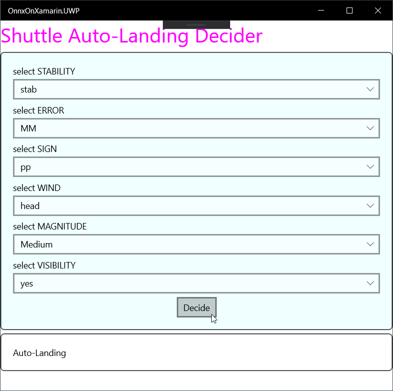

# Shuttle Auto-Landing Decider

This project demonstrates how to use Custom ONNX machine learning model on Xamarin Projects.

The machine learning model is produced from [this](https://notebooks.azure.com/windperson/projects/decisiontreeclassifierdemo) Azure Notebook.

Currently only UWP & iOS can accept ML model converted from [scikit-learn DecisionTreeClassifier](https://scikit-learn.org/stable/modules/generated/sklearn.tree.DecisionTreeClassifier).

